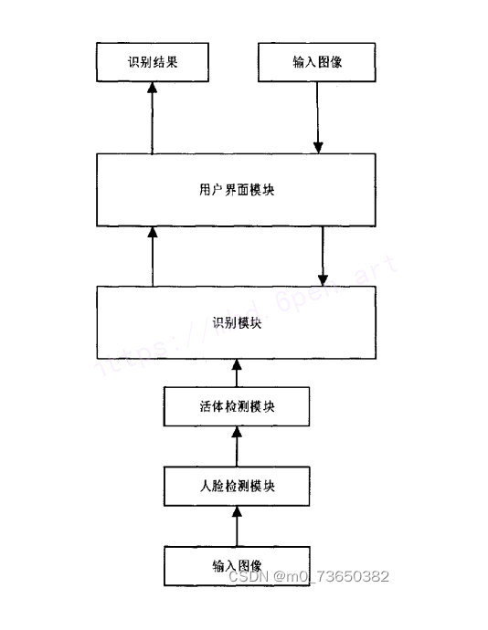
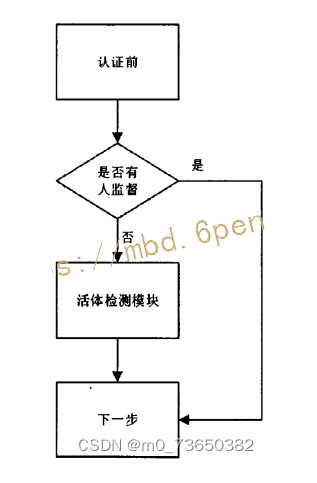
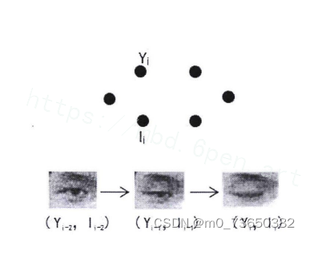
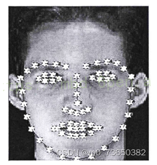
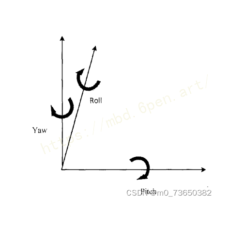
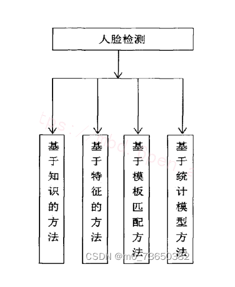
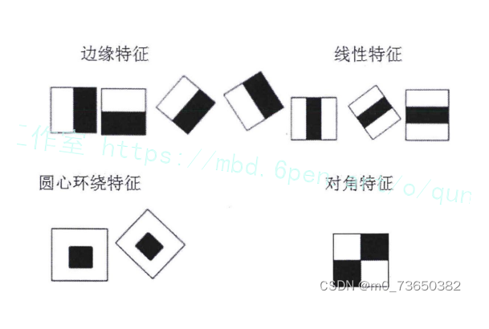



# 1.研究背景与意义


随着科技的不断发展，人脸识别技术已经在各个领域得到广泛应用，如安全监控、人脸支付、人脸解锁等。然而，传统的人脸识别技术存在一些局限性，例如对于静态图片的识别效果较好，但对于动态视频中的人脸识别则存在一定的挑战。为了解决这个问题，基于OpenCV的组合动作常规摄像头人脸活体检测识别系统应运而生。

首先，我们需要了解什么是活体检测。活体检测是指通过检测人脸的生物特征和行为特征，判断其是否为真实的活体而不是静态的照片或者面具。传统的人脸识别技术往往只能识别静态图片，无法有效应对假脸攻击，例如使用照片、面具等欺骗系统。因此，开发一种能够实时检测人脸活体性的技术变得尤为重要。

基于OpenCV的组合动作常规摄像头人脸活体检测识别系统是一种结合了计算机视觉和机器学习的技术，通过使用摄像头实时采集人脸图像，并对其进行分析和处理，以判断人脸是否为真实的活体。该系统主要包括以下几个步骤：

1. 人脸检测：通过OpenCV中的人脸检测算法，实时检测摄像头中的人脸，并提取出人脸区域。

2. 关键点检测：通过深度学习模型，检测人脸中的关键点，如眼睛、嘴巴等。这些关键点的位置信息对于后续的活体检测非常重要。

3. 动作检测：通过分析人脸关键点的位置变化，判断人脸是否具有动作特征。例如，眨眼、张嘴等动作可以被认为是真实的活体特征。

4. 活体判定：根据动作检测的结果，结合其他特征，如红外活体检测、纹理分析等，综合判断人脸是否为真实的活体。

该系统的研究意义主要体现在以下几个方面：

1. 提高人脸识别的安全性：传统的人脸识别技术容易受到假脸攻击，而基于OpenCV的组合动作常规摄像头人脸活体检测识别系统可以有效防止假脸攻击，提高人脸识别的安全性。

2. 提升用户体验：该系统可以实时检测人脸活体性，无需用户进行额外的操作，提升了用户的使用体验。

3. 推动人脸识别技术的发展：基于OpenCV的组合动作常规摄像头人脸活体检测识别系统结合了计算机视觉和机器学习的技术，推动了人脸识别技术的发展，为相关领域的研究提供了新的思路和方法。

总之，基于OpenCV的组合动作常规摄像头人脸活体检测识别系统在提高人脸识别的安全性、提升用户体验以及推动人脸识别技术的发展等方面具有重要的研究意义。通过该系统的研究和应用，我们可以更好地应对人脸识别技术面临的挑战，为实现更安全、更便捷的人脸识别应用提供支持。


# 2.图片演示


# 3.视频演示
[基于OpenCV的组合动作常规摄像头人脸活体检测识别系统](https://www.bilibili.com/video/BV1jQ4y1H7qL/?spm_id_from=333.999.0.0&vd_source=ff015de2d29cbe2a9cdbfa7064407a08)

# 4.系统流程图
本文研究的是人脸活体识别系统，主要用于人脸活体检测和身份的识别。本系统是基于PC机进行的设计，硬件平台为一台是64位Windows10系统的计算机和一个高清摄像头。计算机的具体配置为:CPU: Inter(R)Core(TM) i5-2400H;主频:3.10GHz.图像采集端的摄像头支持频率为每秒30帧。软件开发环境是Visual Studio 2010和图形用户界面开发框架Qt5.5。第三方函数库是开源计算机视觉库OpenCV2.4.9。系统整体运算框架如图所示。



人脸识别在图像层面上的内部流程主要包括四个部分:人脸图像的采集和检测、人脸图像的预处理、人脸图像的特征定位及提取和人脸的匹配与识别[10]。
人脸图像的采集分为主动采集和被动采集。主动采集就是主动配合数据使用人员进行采集。被动采集就是采集人员通过采集设备自动搜索视频中人脸图像或者利用网络摄像头采集人脸。利用特征信息和非人脸特征信息存在阈值差别，人脸检测将待识别图片人脸标定出来为后续处理做准备。
人脸预处理就是对人脸检测的结果在图像层面上进行滤波、直方图均衡化、光线补偿、灰度变换等操作，便于后面对特征的提取。因为采集设备和环境中往往都存在各种不可避免的干扰，所以预处理非常重要。
特征提取是对人脸特定部位或者整体的特征进行提取[5]。对整体特征提取往往用于人脸建模和人脸识别。对特定部位特征提取往往需要进行特征点的定位，比如本设计对人脸68个特征点定位，将此特定应用于活体检测上。
匹配和识别就是比较待识别人脸的特征向量与训练数据库中的人脸特征向量的距离，具体可以设置一个距离阈值表示[2]。如果相似度距离超过阈值则认为不是一个人，距离小于阈值则认为是一个人。这个过程分两种情况，一种是判断两个人是不是一个人，另一种是判断待识别人的信息，比如名字。实质都是一样的，判定信息这种情况是调取训练库对应人的标签。本设计是对人脸信息的识别。
本设计中人脸检测模块采用的是基于Adaboost算法的Haar分类器，识别模块采用经典传统算法进行设计。人脸检测模块接受摄像头采集到的图像，通过Haar分类器判断出图像中是否有人脸，存在人脸之后进行活体识别。人脸动作通过系统指令的要求便可通过活体检测模块。对通过活体检测的人脸图像进行滤波、直方图均衡化等进行预处理进入识别模块，通过识别算法判断人脸对应于数据空间中的位置，完成识别。
人脸识别前的模块是活体检测模块[5]。活体检测的目的是为了防止恶意伪造他人信息做出影响法律和公共秩序的事情，或者一些公司、单位或学校考勤机构中的打卡人员拿取同事或同学可用信息为他人作弊。本设计中的活体检测技术通过验证测试者对指令的配合程度，来判断是否为真人。每次测试中都需要测试者根据系统指令做出脸部或头部姿势，活体检测模块占据了系统通过时间的一大半。本设计的目的是设计一个对光照敏感度不强，并且希望此系统能应用于类似考勤或考试时人员信息验证的系统。因此时效是人脸识别系统的另一个需求，为此本文设计的系统具有双工作状态的模式。系统工作模式框架如图所示。



# 5.核心代码讲解


#### 5.1 f_Face_info.py

```python

class FaceRecognition:
    def __init__(self):
        self.rec_face = f_main.rec()

    def get_face_info(self, im):
        # face detection
        boxes_face = face_recognition.face_locations(im)
        out = []
        if len(boxes_face)!=0:
            for box_face in boxes_face:
                # segmento rostro
                box_face_fc = box_face
                x0,y1,x1,y0 = box_face
                box_face = np.array([y0,x0,y1,x1])
                face_features = {
                    "name":[],
                    "bbx_frontal_face":box_face
                }
                face_image = im[x0:x1,y0:y1]
                # -------------------------------------- face_recognition ---------------------------------------
                face_features["name"] = self.rec_face.recognize_face2(im,[box_face_fc])[0]

                # -------------------------------------- out ---------------------------------------
                out.append(face_features)
        else:
            face_features = {
                "name":[],
                "bbx_frontal_face":[]
            }
            out.append(face_features)
        return out

    def bounding_box(self, out,img):
        for data_face in out:
            box = data_face["bbx_frontal_face"]
            if len(box) == 0:
                continue
            else:
                x0,y0,x1,y1 = box
                img = cv2.rectangle(img,
                                (x0,y0),
                                (x1,y1),
                                (0,0,255),2);
                thickness = 2
                fontSize = 0.6
                step = 13
                try:
                    cv2.putText(img, "name: " +data_face["name"], (x0, y0-step-7), cv2.FONT_HERSHEY_SIMPLEX, fontSize, (0,255,0), thickness)
                except:
                    pass
        return img
```

这个程序文件名为f_Face_info.py，主要功能是通过人脸识别技术获取人脸信息。程序中导入了cv2、numpy和face_recognition等库，并调用了自定义的f_main模块中的rec函数来进行人脸识别。

程序中定义了一个名为get_face_info的函数，该函数接受一张图片作为输入，通过人脸检测算法找到图片中的人脸位置，并将人脸位置信息存储在out列表中。如果检测到人脸，则对每个人脸进行进一步处理，包括截取人脸图像和使用face_recognition模块进行人脸识别，将识别结果存储在face_features字典中。最后将face_features添加到out列表中并返回。

另外，程序中还定义了一个名为bounding_box的函数，该函数接受out列表和图片作为输入，对每个人脸的位置进行绘制边界框和添加人脸姓名的操作，并返回绘制了边界框和姓名的图片。

#### 5.2 image.py

```python


class FaceDetector:
    def __init__(self):
        self.test_mode = "onet"
        self.thresh = [0.9, 0.6, 0.7]
        self.min_face_size = 24
        self.stride = 2
        self.slide_window = False
        self.shuffle = False
        self.detectors = [None, None, None]
        self.prefix = ['./data/MTCNN_model/PNet_landmark/PNet', './data/MTCNN_model/RNet_landmark/RNet', './data/MTCNN_model/ONet_landmark/ONet']
        self.epoch = [18, 14, 16]
        self.model_path = ['%s-%s' % (x, y) for x, y in zip(self.prefix, self.epoch)]
        self.PNet = FcnDetector(P_Net, self.model_path[0])
        self.detectors[0] = self.PNet
        self.RNet = Detector(R_Net, 24, 1, self.model_path[1])
        self.detectors[1] = self.RNet
        self.ONet = Detector(O_Net, 48, 1, self.model_path[2])
        self.detectors[2] = self.ONet

    def detect_faces(self, imagepath):
        mtcnn_detector = MtcnnDetector(detectors=self.detectors, min_face_size=self.min_face_size,
                                       stride=self.stride, threshold=self.thresh, slide_window=self.slide_window)
        corpbbox = None
        frame = cv2.imread(imagepath)
        boxes_c,landmarks = mtcnn_detector.detect(frame)
        print(landmarks.shape)
        for i in range(boxes_c.shape[0]):
            bbox = boxes_c[i, :4]
            score = boxes_c[i, 4]
            corpbbox = [int(bbox[0]), int(bbox[1]), int(bbox[2]), int(bbox[3])]
            # if score > thresh:
            cv2.rectangle(frame, (corpbbox[0], corpbbox[1]),
                          (corpbbox[2], corpbbox[3]), (0,0,255), 1)
            cv2.putText(frame, '{:.3f}'.format(score), (corpbbox[0], corpbbox[1] - 2), cv2.FONT_HERSHEY_SIMPLEX, 0.5,
                        (0, 0, 255), 2)
        for i in range(landmarks.shape[0]):
            for j in range(int(len(landmarks[i])/2)):
                cv2.circle(frame, (int(landmarks[i][2*j]),int(int(landmarks[i][2*j+1]))), 4,(0,0,255),-1)
        # time end
        cv2.imshow("output", frame)
        cv2.waitKey(0)


```

这个程序文件名为image.py，它是一个人脸检测和人脸关键点标定的程序。它使用了MTCNN算法进行人脸检测和关键点标定。

程序首先导入了必要的库和模块，然后设置了一些参数，如检测模式、阈值、最小人脸尺寸等。

接下来，程序加载了训练好的模型，并创建了三个检测器对象，分别用于PNet、RNet和ONet的检测。

然后，程序读取了一张图片作为输入，并使用MtcnnDetector对象对图片进行人脸检测和关键点标定。检测结果包括人脸框和关键点坐标。

最后，程序将检测结果在原图上进行可视化，并显示在窗口中。

整个程序的功能是对输入的图片进行人脸检测和关键点标定，并将结果可视化显示出来。

#### 5.4 mydetect.py

```python

class Detector:
    def __init__(self, weights, device='cpu', imgsz=640, conf_thres=0.7, iou_thres=0.45):
        self.weights = weights
        self.device = device
        self.imgsz = imgsz
        self.conf_thres = conf_thres
        self.iou_thres = iou_thres
        self.model = None
        self.names = None
        self.colors = None

    def load_model(self):
        set_logging()
        self.device = select_device(self.device)
        half = self.device.type != 'cpu'
        self.model = attempt_load(self.weights, map_location=self.device)
        self.imgsz = check_img_size(self.imgsz, s=self.model.stride.max())
        if half:
            self.model.half()

        self.names = self.model.module.names if hasattr(self.model, 'module') else self.model.names
        self.colors = [[random.randint(0, 255) for _ in range(3)] for _ in self.names]

    def letterbox(self, img, new_shape=(640, 640), color=(114, 114, 114), auto=True, scaleFill=False, scaleup=True):
        shape = img.shape[:2]
        if isinstance(new_shape, int):
            new_shape = (new_shape, new_shape)
        r = min(new_shape[0] / shape[0], new_shape[1] / shape[1])
        if not scaleup:
            r = min(r, 1.0)
        ratio = r, r
        new_unpad = int(round(shape[1] * r)), int(round(shape[0] * r))
        dw, dh = new_shape[1] - new_unpad[0], new_shape[0] - new_unpad[1]
        if auto:
            dw, dh = np.mod(dw, 32), np.mod(dh, 32)
        elif scaleFill:
            dw, dh = 0.0, 0.0
            new_unpad = (new_shape[1], new_shape[0])
            ratio = new_shape[1] / shape[1], new_shape[0] / shape[0]
        dw /= 2
        dh /= 2
        if shape[::-1] != new_unpad:
            img = cv2.resize(img, new_unpad, interpolation=cv2.INTER_LINEAR)
        top, bottom = int(round(dh - 0.1)), int(round(dh + 0.1))
        left, right = int(round(dw - 0.1)), int(round(dw + 0.1))
        img = cv2.copyMakeBorder(img, top, bottom, left, right, cv2.BORDER_CONSTANT, value=color)
        return img, ratio, (dw, dh)

    def predict(self, im0s):
        img = torch.zeros((1, 3, self.imgsz, self.imgsz), device=self.device)
        _ = self.model(img.half() if half else img) if self.device.type != 'cpu' else None
        img = self.letterbox(im0s, new_shape=self.imgsz)[0]
        img = img[:, :, ::-1].transpose(2, 0, 1)
        img = np.ascontiguousarray(img)
        img = torch.from_numpy(img).to(self.device)
        img = img.half() if half else img.float()
        img /= 255.0
        if img.ndimension() == 3:
            img = img.unsqueeze(0)
        pred = self.model(img)[0]
        pred = non_max_suppression(pred, self.conf_thres, self.iou_thres)
        ret = []
        for i, det in enumerate(pred):
            if len(det):
                det[:, :4] = scale_coords(img.shape[2:], det[:, :4], im0s.shape).round()
                for *xyxy, conf, cls in reversed(det):
                    label = f'{self.names[int(cls)]}'
                    prob = round(float(conf) * 100, 2)
                    ret_i = [label, prob, xyxy]
                    ret.append(ret_i)
        return ret
```

这个程序文件名为mydetect.py，它是一个使用yolo算法进行目标检测的接口函数。该函数接受一张图片作为输入，并返回检测到的目标的标签、置信度和位置信息。具体实现过程如下：

1. 导入所需的库，包括torch、numpy和cv2等。
2. 定义了一个名为letterbox的函数，用于调整图片的大小和填充。
3. 设置了一些参数，包括模型的权重文件路径、设备类型、图片大小、置信度阈值和iou阈值等。
4. 初始化模型，并加载权重文件。
5. 定义了一个名为predict的函数，用于进行目标检测。
6. 在predict函数中，首先将输入的图片转换为模型所需的格式，并进行预处理。
7. 调用模型进行推理，得到预测结果。
8. 对预测结果进行非极大值抑制，去除重叠的边界框。
9. 处理检测结果，将标签、置信度和位置信息保存到一个列表中。
10. 返回检测结果列表。

该程序文件可以用于对图片进行目标检测，检测的目标包括人脸、烟雾、饮料和手机等。

#### 5.5 myfatigue.py

```python


class FatigueDetection:
    def __init__(self):
        # 初始化DLIB的人脸检测器（HOG），然后创建面部标志物预测
        print("[INFO] loading facial landmark predictor...")
        # 使用dlib.get_frontal_face_detector() 获得脸部位置检测器
        self.detector = dlib.get_frontal_face_detector()
        # 使用dlib.shape_predictor获得脸部特征位置检测器
        self.predictor = dlib.shape_predictor('weights/shape_predictor_68_face_landmarks.dat')
        # 分别获取左右眼面部标志的索引
        (self.lStart, self.lEnd) = face_utils.FACIAL_LANDMARKS_IDXS["left_eye"]
        (self.rStart, self.rEnd) = face_utils.FACIAL_LANDMARKS_IDXS["right_eye"]
        (self.mStart, self.mEnd) = face_utils.FACIAL_LANDMARKS_IDXS["mouth"]

    def eye_aspect_ratio(self, eye):
        # 垂直眼标志（X，Y）坐标
        A = dist.euclidean(eye[1], eye[5])  # 计算两个集合之间的欧式距离
        B = dist.euclidean(eye[2], eye[4])
        # 计算水平之间的欧几里得距离
        # 水平眼标志（X，Y）坐标
        C = dist.euclidean(eye[0], eye[3])
        # 眼睛长宽比的计算
        ear = (A + B) / (2.0 * C)
        # 返回眼睛的长宽比
        return ear

    def mouth_aspect_ratio(self, mouth):  # 嘴部
        A = np.linalg.norm(mouth[2] - mouth[10])  # 51, 59
        B = np.linalg.norm(mouth[4] - mouth[8])  # 53, 57
        C = np.linalg.norm(mouth[0] - mouth[6])  # 49, 55
        mar = (A + B) / (2.0 * C)
        return mar

    def detect_fatigue(self, frame):
        #frame = imutils.resize(frame, width=720)
        gray = cv2.cvtColor(frame, cv2.COLOR_BGR2GRAY)
        # 使用detector(gray, 0) 进行脸部位置检测
        rects = self.detector(gray, 0)
        eyear = 0.0
        mouthar = 0.0
        # 循环脸部位置信息，使用predictor(gray, rect)获得脸部特征位置的信息
        for rect in rects:
            shape = self.predictor(gray, rect)

            # 将脸部特征信息转换为数组array的格式
            shape = face_utils.shape_to_np(shape)

            # 提取左眼和右眼坐标
            leftEye = shape[self.lStart:self.lEnd]
            rightEye = shape[self.rStart:self.rEnd]
            # 嘴巴坐标
            mouth = shape[self.mStart:self.mEnd]

            # 构造函数计算左右眼的EAR值，使用平均值作为最终的EAR
            leftEAR = self.eye_aspect_ratio(leftEye)
            rightEAR = self.eye_aspect_ratio(rightEye)
            eyear = (leftEAR + rightEAR) / 2.0
            # 打哈欠
            mouthar = self.mouth_aspect_ratio(mouth)

            # 标注识别结果
            # 使用cv2.convexHull获得凸包位置，使用drawContours画出轮廓位置进行画图操作
            leftEyeHull = cv2.convexHull(leftEye)
            rightEyeHull = cv2.convexHull(rightEye)
            cv2.drawContours(frame, [leftEyeHull], -1, (0, 255, 0), 1)
            cv2.drawContours(frame, [rightEyeHull], -1, (0, 255, 0), 1)
            mouthHull = cv2.convexHull(mouth)
            cv2.drawContours(frame, [mouthHull], -1, (0, 255, 0), 1)

            # 画出眼睛、嘴巴竖直线
            cv2.line(frame,tuple(shape[38]),tuple(shape[40]),(0, 255, 0), 1)
            cv2.line(frame,tuple(shape[43]),tuple(shape[47]),(0, 255, 0), 1)
            cv2.line(frame,tuple(shape[51]),tuple(shape[57]),(0, 255, 0), 1)
            cv2.line(frame,tuple(shape[48]),tuple(shape[54]),(0, 255, 0), 1)

        # 返回信息
        # frame已经标注出眼睛和嘴巴的框线
        # eyeae为眼睛的长宽比
        # mouthar为嘴巴的长宽比
        return(frame, eyear, mouthar)
```

这个程序文件名为myfatigue.py，主要功能是进行疲劳检测，检测眼睛和嘴巴的开合程度。

程序使用了一些库，包括scipy、imutils、numpy、argparse、dlib和cv2。其中，scipy库用于计算欧式距离，imutils库用于视频处理，numpy库用于数据处理，argparse库用于命令行参数解析，dlib库用于人脸检测和特征位置检测，cv2库用于图像处理。

程序定义了两个函数，分别是eye_aspect_ratio和mouth_aspect_ratio。eye_aspect_ratio函数用于计算眼睛的长宽比，mouth_aspect_ratio函数用于计算嘴巴的长宽比。

程序的主要部分是detfatigue函数，该函数接收一个帧（图像），并进行疲劳检测。首先，将图像转换为灰度图像，然后使用人脸检测器检测脸部位置信息。接着，使用特征位置检测器获取脸部特征位置信息。然后，提取左眼、右眼和嘴巴的坐标。通过计算左右眼的长宽比和嘴巴的长宽比，得到眼睛和嘴巴的开合程度。最后，将检测结果标注在图像上，并返回标注后的图像、眼睛的长宽比和嘴巴的长宽比。

整个程序的功能是通过检测眼睛和嘴巴的开合程度来进行疲劳检测。


# 6.系统整体结构

根据以上分析，该程序的整体功能是基于OpenCV的组合动作常规摄像头人脸活体检测识别系统。它包含了多个文件，每个文件都有不同的功能，下面是对每个文件功能的整理：

| 文件路径 | 功能 |
|---------|------|
| config.py | 配置情绪检测和人脸识别模块的参数 |
| f_Face_info.py | 获取人脸信息，包括人脸位置和识别结果 |
| image.py | 进行人脸检测和关键点标定 |
| myfatigue.py | 进行疲劳检测，检测眼睛和嘴巴的开合程度 |
| myframe.py | 进行疲劳检测和物体检测，并返回检测结果和处理后的帧 |
| ui.py | 用户界面，用于显示检测结果和控制系统 |
| video.py | 视频处理，包括读取视频、处理帧和保存视频 |
| Detection\detector.py | 目标检测器的基类 |
| Detection\fcn_detector.py | 使用全卷积网络进行目标检测 |
| Detection\MtcnnDetector.py | 使用MTCNN算法进行人脸检测和关键点标定 |
| Detection\nms.py | 非极大值抑制算法 |
| models\common.py | 公共模型函数 |
| models\experimental.py | 实验性模型函数 |
| models\export.py | 模型导出函数 |
| my_face_recognition\f_face_recognition.py | 人脸识别模块的接口函数 |
| my_face_recognition\f_main.py | 人脸识别模块的主函数 |
| my_face_recognition\f_storage.py | 人脸识别模块的存储函数 |
| prepare_data\BBox_utils.py | 边界框处理函数 |
| prepare_data\data_utils.py | 数据处理函数 |
| prepare_data\gen_12net_data.py | 生成12Net模型的训练数据 |
| prepare_data\gen_hard_example.py | 生成难例样本 |
| prepare_data\gen_imglist_onet.py | 生成ONet模型的图像列表 |
| prepare_data\gen_imglist_pnet.py | 生成PNet模型的图像列表 |
| prepare_data\gen_imglist_rnet.py | 生成RNet模型的图像列表 |
| prepare_data\gen_landmark_aug_12.py | 生成12Net模型的关键点增强数据 |
| prepare_data\gen_landmark_aug_24.py | 生成24Net模型的关键点增强数据 |
| prepare_data\gen_landmark_aug_48.py | 生成48Net模型的关键点增强数据 |
| prepare_data\gen_ONet_tfrecords.py | 生成ONet模型的TFRecords数据 |
| prepare_data\gen_PNet_tfrecords.py | 生成PNet模型的TFRecords数据 |
| prepare_data\gen_RNet_tfrecords.py | 生成RNet模型的TFRecords数据 |
| prepare_data\Landmark_utils.py | 关键点处理函数 |
| prepare_data\loader.py | 数据加载函数 |
| prepare_data\minibatch.py | 小批量数据处理函数 |
| prepare_data\read_tfrecord_v2.py | 读取TFRecords数据函数 |
| prepare_data\tfrecord_utils.py | TFRecords数据处理函数 |
| prepare_data\utils.py | 数据处理工具函数 |
| test\camera_test.py | 相机测试函数 |
| test\generate_wider_result.py | 生成WIDER FACE数据集的结果 |
| test\imdb.py | 图像数据库类 |
| test\merge_FDDB_files.py | 合并FDDB数据集文件 |
| test\one_image_test.py | 单张图像测试函数 |
| test\RunOnFDDBLandmark.py | 在FDDB数据集上运行关键点检测 |
| train_models\MTCNN_config.py | MTCNN模型的配置文件 |
| train_models\mtcnn_model.py | MTCNN模型的定义和训练函数 |
| train_models\train_ONet.py | 训练ONet模型的函数 |
| train_models\train_PNet.py | 训练PNet模型的函数 |
| train_models\train_RNet.py | 训练RNet模型的函数 |
| utils\activations.py | 激活函数 |
| utils\autoanchor.py | 自动锚框生成函数 |
| utils\datasets.py | 数据集类 |
| utils\general.py | 通用函数 |
| utils\google_utils.py | Google云存储函数 |
| utils\loss.py | 损失函数 |
| utils\metrics.py | 模型评估指标函数 |
| utils\plots.py | 绘图函数 |
| utils\torch_utils.py | PyTorch工具函数 |
| utils\__init__.py | 初始化文件 |
| utils\wandb_logging\log_dataset.py | 数据集日志记录函数 |

# 7.人脸活体检测模块
虽然人脸识别已经研究了30多年了，但是活体检测的研究是近几年才得到了关注。随着技术的发展，正面技术取得了很大突破，一些为了攻破系统的被反面利用的技术和手段也应运而生。一些不法分子或者投机取巧之人恶意通过不合理途径得到的照片或视频攻破人脸识别系统。因此在人脸识别系统中加入活体检测模块来判断待识别生物是否是真人或本人很重要。本系统的设计的活体检测是通过检测人脸的细微动作和运动信息，判断是否与机器指令要求符合的方法。
#### 活体检测方法
本节主要介绍人脸活体检测的方法，包括基于微小纹理的活体检测方法，基于运动信息的活体检测方法和基于多光谱的活体检测方法。
首先介绍基于微小纹理的活体检测方法。通常伪造人都是拿着合法用户的照片或者录制视频试图通过系统的验证。但是，实际情况下由于采集设备和环境等因素的影响，会产生失真。这样，同一设备采集的真人脸和伪造人脸的图像细节存在差异，这些细节差异就是图像微纹理上的差异。以录制的视频为例，这个过程有两个环节造成图像细节差异，一是非法用户首先用录像设备录制人脸视频，受设备和环境因素，视频信息和本人信息产生差异;二是，采集设备采集视频中人脸信息，采集设备不可能将视频中的人脸信息复制下来。因此，系统采集设备采集到的信息和经过两个环节采到的信息在图像细节方面存在差异，伪造的人脸存在信息缺失。基于这一特点，[2021年国际生物特征识别联合会议上Jukka 等人提出了基于微纹理的分析方法。](https://afdian.net/item/a24dd0e4786011eeb8a65254001e7c00)
其次介绍基于运动信息的活体检测方法。照片和视频中的人脸不会运动或者运动与真实要求在时间和空间上不一致。因此通过检测脸部的细微动作可以判断是不是真实人脸:如睁眨眼、嘴唇闭合、头部姿势状态。Pan[7]等人利用眨眼动作来进行活体检测，其检测方法如图3-1所示。他们为不同阶段的眨眼动作建立了模型，测试时使用常规的动态规划算法便可完成眼睛状态的识别。Kollreider等人[4]利用嘴部闭合动作进行活体检测。该方法首先需要精确定位出人脸区域及嘴部区域，分析唇部动作和阅读文本应有的唇部动作的匹配情况来判断人脸真伪。Kollreider等人提出利用人脸多个部件的时序运动信息来做出帧间人脸的判定。提出依据是，人脸具有明显的三维结构，在运动时人脸中心区域的运动幅度比人脸周围区域的运动幅度大，并且两者运动方向也相反。而照片中所有区域是一体的，运动模式一样。在这种思路的基础上，演变和进化出了很多方法。


最后介绍基于多光谱的检测方法。我们知道真人的皮肤和伪造的人脸的材质是不一样的，这种差异在成像系统中就是反射率的差异。可见光的条件下，这种反射特性差异不明显。我们的肉眼也可能分辨不出来是真的人脸还是3D仿真人脸头套。电磁波根据波长分很多种类型。其中无线电波和微波、x、r射线可分别应用在通信领域、医学领域和核物理领域。它们在一般的实验室条件下都难于获取，并且对人体有害。而红外光，紫外光反而比较安全，获取简单，常用于多光谱人脸活体检测。目前，利用多光谱进行人脸活体检测的方法可以对伪造的3D人脸模型有较好的辨别能力[5]。但是这种方法采集图像较复杂，需要认证者很好的配合能力，不要露出额头上的头发等。此外，它对采集设备的要求也比较高，这种情况在实际系统中有一定的局限性，限制了推广。
综合考虑以上方法的优缺点和实验可能完成性，本系统活体检测模块选用的是基于运动信息的活体检测方法。思路是[基于美国CMU开源的IntraFace源代码](https://mbd.pub/o/bread/ZZWcmptw)，提取人脸特征点。由于此开源算法不仅能精确定位特征点，还能检测头部三位姿态，并且实时性强，受到了商业机构、学者和一些高校的使用。常用的人脸特征点有68个，定位表示如图所示。

检测原理以眼睛为例，参考上图3-1眼睛的状态。我们将Iz和Y,z视为睁眼时眼睛对应的上下两个特征点位置，做标用x和y表示。假设此时特征点位置距离为d。眼睛睁到I，Y,，时，特征点位置距离为d。眼睛闭上时，特征点位置记为I，Y,位置距离为0。当距离d大于某个值，判断结果为睁眼，当d小于某个值时，判断结果为闭眼，这个值称之为阈值。同理检测嘴巴状态也是这样。而头部姿态是指摇头情况，低头抬头情况，前倾后仰情况。其中，固定头部中心位置时，前倾后仰情况往往影响的是低头抬头的角度变化。为了简化系统，使系统更灵敏，本设计只考虑左转、右转、低头、抬头情况。三维人脸头部姿势如图所示。Pitch为低头和抬头情况，yaw为左转头和右转头情况。系统运行时，根据系统发出的指令要求做出相应的动作，动作一致则通过验证，不一致则活体验证失败。



# 8.人脸检测
通俗地讲，人脸检测就是检查图像中有没有人的脸，然后标出其位置，它是人脸识别的基础工作。每个人的脸上都有共同的固定特性，比如都是由两条眉毛、两只眼睛眼睛、一个鼻子、一个嘴巴组成，并且它们都具有外形的相似性。因此，人脸信息可以被描述和表达。随着科技的发展和人工智能的兴起，人脸检测技术也得到了飞速的发展，目前已经完全能支持实际应用。先后发展过的模型有模板匹配模型，肤色模型，SVM模型，Adaboost模型。大致分类图如图所示。



基于知识的方法是一种自上而下的方法[6]。众所周知，人脸都是对称的，都有眼睛，眉毛，鼻子等，并且它们之间的相对距离有一定的规律。基于知识的方法就是利用我们的先验知识，制定区分的准则。在判断是否有人脸时，先提取待测图片的特征，通过已经制定的准则去过滤，通过则为人脸，反之为非人脸。这种方法缺点是不容易制定规则，每个人五官之间的相对位置等都有所差别，规则太细，则正确人脸也可能被误判，规则太宽泛，则准确率低。而基于特征的方法刚好与基于知识的方法相反，它是一种自下而上的方法。它试图找到人脸中的不变的共性,根据五官特征建立模型，描述它们之间的关系来判断是否是人脸。这种方法简单方便，缺点是对光照、噪声等比较敏感，图像边缘容易被弱化，特征容易被破坏。
基于模板匹配的方法是一种经典的检测方法[7]。它的检测思想是,制定人脸模板，判断检测图像与人脸模板的相关程度，由相关程度来判断人脸是否存在。这种方法简单方便，但是不能适应人脸姿势的变化，表情的变化，识别率并不是很高。
基于统计学习的方法，顾名思义就是学习。这种方法事先不需要制定准则，也不需要了解人脸特征。利用机器学习的思想，对人脸(正样本)和非人脸(负样本)两类样例进行训练，利用描述人脸的特征(如haar特征)，训练成分类器，用它来检测人脸。它是目前主流的人脸检测方式，成为人们研究的重点。基于以上特点，本课题采用此方法进行人脸检测的研究。
#### Haar特征
Haar-like是用来描述事物像素特点的矩形特征，现被广泛用于描述人脸特征[1]。起初,Papageorgiou等人[将Haar特征应用到人脸检测中。Viola和Jone在此基础上，提出了三种基本类型的Haar特征:边缘特征、线性特征、对角线特征。之后，Lienhart等人对Haar特征进行了扩展,将基本模型旋转45度,形成了四种类型的Haar特征。Haar矩形特征图如图所示。


# 9.系统整合
下图[完整源码＆环境部署视频教程＆自定义UI界面](https://s.xiaocichang.com/s/ae7cd5)


参考博客[《基于协同双注意力机制CDAM2改进YOLOv7的工地安全帽佩戴检测系统》](https://mbd.pub/o/qunshan/work)

# 10.参考文献
---
[1][杨超](https://s.wanfangdata.com.cn/paper?q=%E4%BD%9C%E8%80%85:%22%E6%9D%A8%E8%B6%85%22),[蔡晓东](https://s.wanfangdata.com.cn/paper?q=%E4%BD%9C%E8%80%85:%22%E8%94%A1%E6%99%93%E4%B8%9C%22),[王丽娟](https://s.wanfangdata.com.cn/paper?q=%E4%BD%9C%E8%80%85:%22%E7%8E%8B%E4%B8%BD%E5%A8%9F%22),等.[一种改进的CAMShift跟踪算法及人脸检测框架](https://d.wanfangdata.com.cn/periodical/jsjgcykx201609019)[J].[计算机工程与科学](https://sns.wanfangdata.com.cn/perio/jsjgcykx).2016,(9).DOI:[10.3969/j.issn.1007-130X.2016.09.019](https://zhuanlan.zhihu.com/p/664450402/edit) .

[2][覃南鑫](https://s.wanfangdata.com.cn/paper?q=%E4%BD%9C%E8%80%85:%22%E8%A6%83%E5%8D%97%E9%91%AB%22).[基于OpenCV的人脸识别系统的研究与实现](https://d.wanfangdata.com.cn/thesis/D01848226)[D].2012.

[3][蒋雨欣](https://s.wanfangdata.com.cn/paper?q=%E4%BD%9C%E8%80%85:%22%E8%92%8B%E9%9B%A8%E6%AC%A3%22),[李松斌](https://s.wanfangdata.com.cn/paper?q=%E4%BD%9C%E8%80%85:%22%E6%9D%8E%E6%9D%BE%E6%96%8C%22),[刘鹏](https://s.wanfangdata.com.cn/paper?q=%E4%BD%9C%E8%80%85:%22%E5%88%98%E9%B9%8F%22),等.[基于多特征深度学习的人脸性别识别](https://d.wanfangdata.com.cn/periodical/jsjgcysj201601043)[J].[计算机工程与设计](https://sns.wanfangdata.com.cn/perio/jsjgcysj).2016,(1).DOI:[10.16208/j.issn1000-7024.2016.01.043](https://zhuanlan.zhihu.com/p/664450402/edit) .

[4][朱俊勇](https://s.wanfangdata.com.cn/paper?q=%E4%BD%9C%E8%80%85:%22%E6%9C%B1%E4%BF%8A%E5%8B%87%22),[赖剑煌](https://s.wanfangdata.com.cn/paper?q=%E4%BD%9C%E8%80%85:%22%E8%B5%96%E5%89%91%E7%85%8C%22).[面向视频的动态人脸识别研究进展](https://d.wanfangdata.com.cn/periodical/gdgakj201502001)[J].[广东公安科技](https://sns.wanfangdata.com.cn/perio/gdgakj).2015,(2).

[5][盘海玲](https://s.wanfangdata.com.cn/paper?q=%E4%BD%9C%E8%80%85:%22%E7%9B%98%E6%B5%B7%E7%8E%B2%22).[人脸识别系统中活体检测技术](https://d.wanfangdata.com.cn/periodical/kjzx201510179)[J].[科技资讯](https://sns.wanfangdata.com.cn/perio/kjzx).2015,(10).DOI:[10.3969/j.issn.1672-3791.2015.10.179](https://zhuanlan.zhihu.com/p/664450402/edit) .

[6][黄叶珏](https://s.wanfangdata.com.cn/paper?q=%E4%BD%9C%E8%80%85:%22%E9%BB%84%E5%8F%B6%E7%8F%8F%22).[基于交互式随机动作的人脸活体检测](https://d.wanfangdata.com.cn/periodical/rjdk201512009)[J].[软件导刊](https://sns.wanfangdata.com.cn/perio/rjdk).2015,(12).DOI:[10.11907/rjdk.1511355](https://zhuanlan.zhihu.com/p/664450402/edit) .

[7][李文昊](https://s.wanfangdata.com.cn/paper?q=%E4%BD%9C%E8%80%85:%22%E6%9D%8E%E6%96%87%E6%98%8A%22),[陈泽华](https://s.wanfangdata.com.cn/paper?q=%E4%BD%9C%E8%80%85:%22%E9%99%88%E6%B3%BD%E5%8D%8E%22).[一种改进的AdaBoost人脸检测算法](https://d.wanfangdata.com.cn/periodical/dsjs201415052)[J].[电视技术](https://sns.wanfangdata.com.cn/perio/dsjs).2014,(15).DOI:[10.3969/j.issn.1002-8692.2014.15.052](https://zhuanlan.zhihu.com/p/664450402/edit) .

[8][王宪](https://s.wanfangdata.com.cn/paper?q=%E4%BD%9C%E8%80%85:%22%E7%8E%8B%E5%AE%AA%22),[张彦](https://s.wanfangdata.com.cn/paper?q=%E4%BD%9C%E8%80%85:%22%E5%BC%A0%E5%BD%A6%22),[慕鑫](https://s.wanfangdata.com.cn/paper?q=%E4%BD%9C%E8%80%85:%22%E6%85%95%E9%91%AB%22),等.[基于改进的LBP人脸识别算法](https://d.wanfangdata.com.cn/periodical/gdgc201207017)[J].[光电工程](https://sns.wanfangdata.com.cn/perio/gdgc).2012,(7).DOI:[10.3969/j.issn.1003-501X.2012.07.017](https://zhuanlan.zhihu.com/p/664450402/edit) .

[9][李扬](https://s.wanfangdata.com.cn/paper?q=%E4%BD%9C%E8%80%85:%22%E6%9D%8E%E6%89%AC%22),[孙劲光](https://s.wanfangdata.com.cn/paper?q=%E4%BD%9C%E8%80%85:%22%E5%AD%99%E5%8A%B2%E5%85%89%22).[一种混合特征的人脸识别算法仿真研究](https://d.wanfangdata.com.cn/periodical/jsjfz201201053)[J].[计算机仿真](https://sns.wanfangdata.com.cn/perio/jsjfz).2012,(1).DOI:[10.3969/j.issn.1006-9348.2012.01.053](https://zhuanlan.zhihu.com/p/664450402/edit) .

[10][朱超平](https://s.wanfangdata.com.cn/paper?q=%E4%BD%9C%E8%80%85:%22%E6%9C%B1%E8%B6%85%E5%B9%B3%22).[基于人脸识别的门禁系统设计与实现](https://d.wanfangdata.com.cn/periodical/yzdxxb-zr201104016)[J].[重庆工商大学学报（自然科学版）](https://sns.wanfangdata.com.cn/perio/yzdxxb-zr).2011,(4).DOI:[10.3969/j.issn.1672-058X.2011.04.016](https://zhuanlan.zhihu.com/p/664450402/edit) .


---
#### 如果您需要更详细的【源码和环境部署教程】，除了通过【系统整合】小节的链接获取之外，还可以通过邮箱以下途径获取:
#### 1.请先在GitHub上为该项目点赞（Star），编辑一封邮件，附上点赞的截图、项目的中文描述概述（About）以及您的用途需求，发送到我们的邮箱
#### sharecode@yeah.net
#### 2.我们收到邮件后会定期根据邮件的接收顺序将【完整源码和环境部署教程】发送到您的邮箱。
#### 【免责声明】本文来源于用户投稿，如果侵犯任何第三方的合法权益，可通过邮箱联系删除。